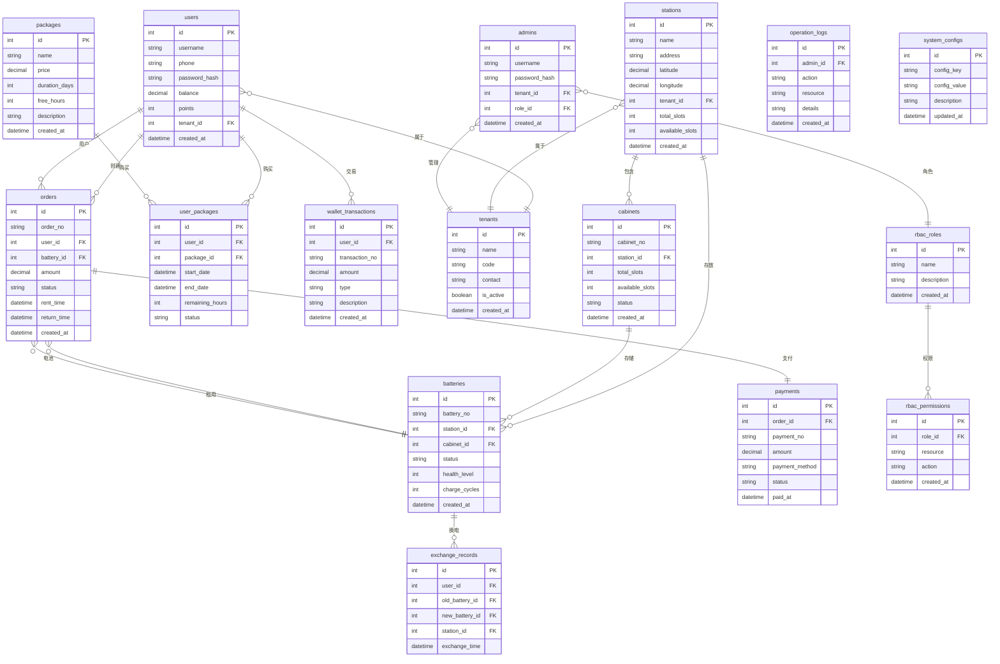
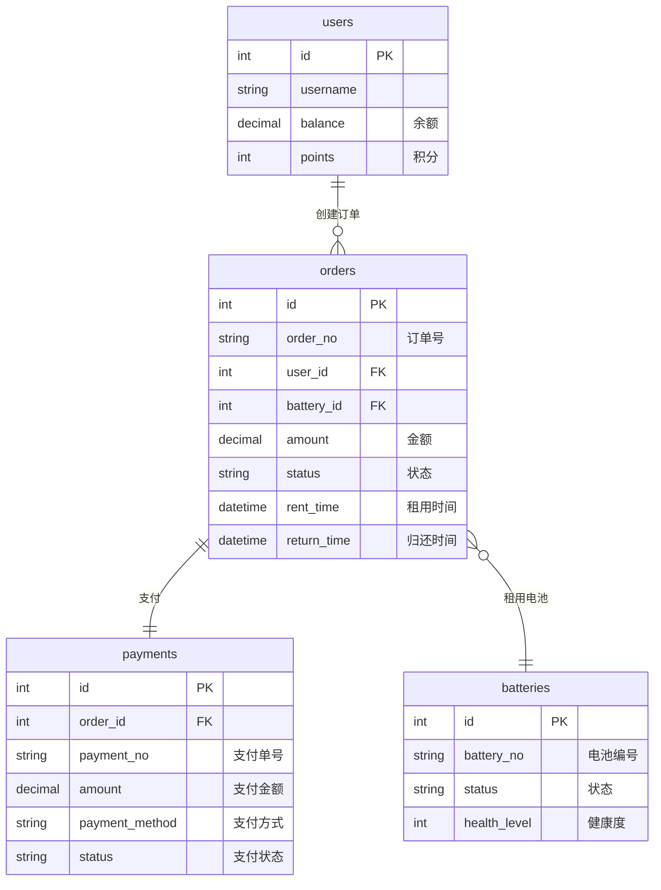
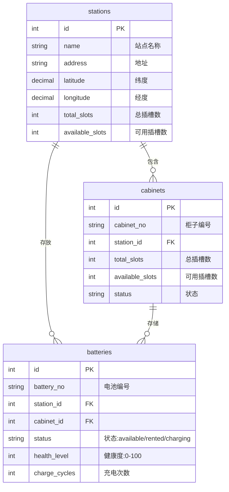
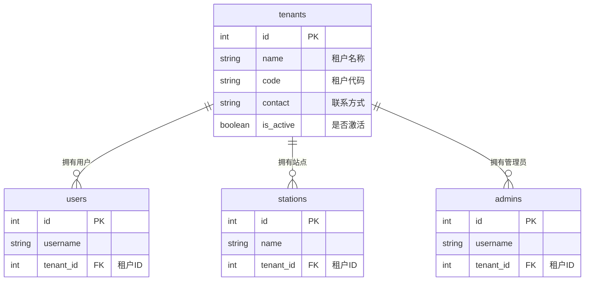
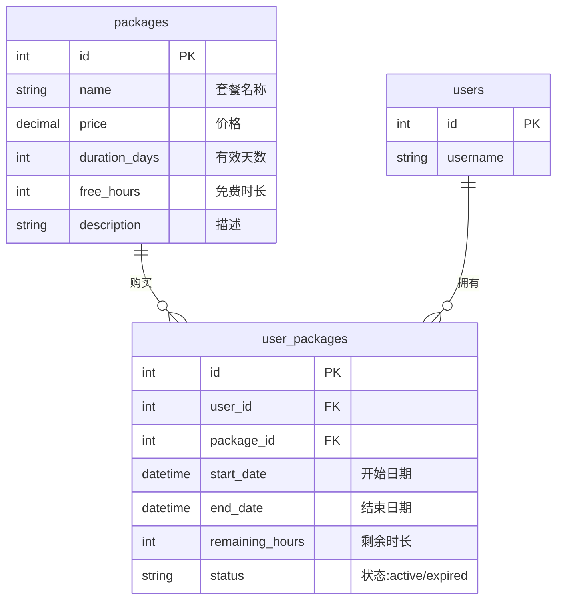

# 电池SaaS平台 - 数据库ER图

## 1. 完整ER图



## 2. 核心业务关系图

### 2.1 用户-订单-支付关系



### 2.2 站点-柜子-电池关系



### 2.3 多租户关系



### 2.4 套餐-用户套餐关系



## 3. 数据表详细说明

### 3.1 用户相关表

#### users - 用户表
| 字段 | 类型 | 说明 | 约束 |
|------|------|------|------|
| id | INT | 主键 | PK, AUTO_INCREMENT |
| username | VARCHAR(50) | 用户名 | UNIQUE, NOT NULL |
| phone | VARCHAR(20) | 手机号 | UNIQUE, NOT NULL |
| password_hash | VARCHAR(255) | 密码哈希 | NOT NULL |
| balance | DECIMAL(10,2) | 余额 | DEFAULT 0.00 |
| points | INT | 积分 | DEFAULT 0 |
| tenant_id | INT | 租户ID | FK, NOT NULL |
| is_active | BOOLEAN | 是否激活 | DEFAULT TRUE |
| real_name | VARCHAR(50) | 真实姓名 | NULL |
| id_card | VARCHAR(18) | 身份证号 | NULL |
| created_at | DATETIME | 创建时间 | DEFAULT NOW() |
| updated_at | DATETIME | 更新时间 | ON UPDATE NOW() |

#### tenants - 租户表
| 字段 | 类型 | 说明 | 约束 |
|------|------|------|------|
| id | INT | 主键 | PK, AUTO_INCREMENT |
| name | VARCHAR(100) | 租户名称 | UNIQUE, NOT NULL |
| code | VARCHAR(50) | 租户代码 | UNIQUE, NOT NULL |
| contact | VARCHAR(100) | 联系方式 | NULL |
| is_active | BOOLEAN | 是否激活 | DEFAULT TRUE |
| created_at | DATETIME | 创建时间 | DEFAULT NOW() |

### 3.2 设备相关表

#### stations - 站点表
| 字段 | 类型 | 说明 | 约束 |
|------|------|------|------|
| id | INT | 主键 | PK, AUTO_INCREMENT |
| name | VARCHAR(100) | 站点名称 | NOT NULL |
| address | VARCHAR(255) | 地址 | NOT NULL |
| latitude | DECIMAL(10,7) | 纬度 | NOT NULL |
| longitude | DECIMAL(10,7) | 经度 | NOT NULL |
| tenant_id | INT | 租户ID | FK, NOT NULL |
| total_slots | INT | 总插槽数 | DEFAULT 0 |
| available_slots | INT | 可用插槽数 | DEFAULT 0 |
| status | VARCHAR(20) | 状态 | DEFAULT 'active' |
| created_at | DATETIME | 创建时间 | DEFAULT NOW() |

#### cabinets - 柜子表
| 字段 | 类型 | 说明 | 约束 |
|------|------|------|------|
| id | INT | 主键 | PK, AUTO_INCREMENT |
| cabinet_no | VARCHAR(50) | 柜子编号 | UNIQUE, NOT NULL |
| station_id | INT | 站点ID | FK, NOT NULL |
| total_slots | INT | 总插槽数 | DEFAULT 0 |
| available_slots | INT | 可用插槽数 | DEFAULT 0 |
| status | VARCHAR(20) | 状态 | DEFAULT 'active' |
| created_at | DATETIME | 创建时间 | DEFAULT NOW() |

#### batteries - 电池表
| 字段 | 类型 | 说明 | 约束 |
|------|------|------|------|
| id | INT | 主键 | PK, AUTO_INCREMENT |
| battery_no | VARCHAR(50) | 电池编号 | UNIQUE, NOT NULL |
| station_id | INT | 站点ID | FK, NULL |
| cabinet_id | INT | 柜子ID | FK, NULL |
| status | VARCHAR(20) | 状态 | DEFAULT 'available' |
| health_level | INT | 健康度(0-100) | DEFAULT 100 |
| charge_cycles | INT | 充电次数 | DEFAULT 0 |
| last_maintenance | DATETIME | 上次维护时间 | NULL |
| created_at | DATETIME | 创建时间 | DEFAULT NOW() |

**电池状态说明**：
- `available` - 可用
- `rented` - 已租出
- `charging` - 充电中
- `maintenance` - 维护中
- `damaged` - 损坏

### 3.3 业务相关表

#### orders - 订单表
| 字段 | 类型 | 说明 | 约束 |
|------|------|------|------|
| id | INT | 主键 | PK, AUTO_INCREMENT |
| order_no | VARCHAR(50) | 订单号 | UNIQUE, NOT NULL |
| user_id | INT | 用户ID | FK, NOT NULL |
| battery_id | INT | 电池ID | FK, NOT NULL |
| amount | DECIMAL(10,2) | 金额 | NOT NULL |
| status | VARCHAR(20) | 状态 | DEFAULT 'pending' |
| rent_time | DATETIME | 租用时间 | NOT NULL |
| return_time | DATETIME | 归还时间 | NULL |
| created_at | DATETIME | 创建时间 | DEFAULT NOW() |

**订单状态说明**：
- `pending` - 待支付
- `paid` - 已支付
- `using` - 使用中
- `completed` - 已完成
- `cancelled` - 已取消

#### payments - 支付表
| 字段 | 类型 | 说明 | 约束 |
|------|------|------|------|
| id | INT | 主键 | PK, AUTO_INCREMENT |
| order_id | INT | 订单ID | FK, NOT NULL |
| payment_no | VARCHAR(50) | 支付单号 | UNIQUE, NOT NULL |
| amount | DECIMAL(10,2) | 支付金额 | NOT NULL |
| payment_method | VARCHAR(20) | 支付方式 | NOT NULL |
| status | VARCHAR(20) | 支付状态 | DEFAULT 'pending' |
| paid_at | DATETIME | 支付时间 | NULL |
| created_at | DATETIME | 创建时间 | DEFAULT NOW() |

**支付方式**：
- `wechat` - 微信支付
- `alipay` - 支付宝
- `balance` - 余额支付

#### packages - 套餐表
| 字段 | 类型 | 说明 | 约束 |
|------|------|------|------|
| id | INT | 主键 | PK, AUTO_INCREMENT |
| name | VARCHAR(100) | 套餐名称 | NOT NULL |
| price | DECIMAL(10,2) | 价格 | NOT NULL |
| duration_days | INT | 有效天数 | NOT NULL |
| free_hours | INT | 免费时长(小时) | DEFAULT 0 |
| description | TEXT | 描述 | NULL |
| is_active | BOOLEAN | 是否激活 | DEFAULT TRUE |
| created_at | DATETIME | 创建时间 | DEFAULT NOW() |

#### user_packages - 用户套餐表
| 字段 | 类型 | 说明 | 约束 |
|------|------|------|------|
| id | INT | 主键 | PK, AUTO_INCREMENT |
| user_id | INT | 用户ID | FK, NOT NULL |
| package_id | INT | 套餐ID | FK, NOT NULL |
| start_date | DATETIME | 开始日期 | NOT NULL |
| end_date | DATETIME | 结束日期 | NOT NULL |
| remaining_hours | INT | 剩余时长 | DEFAULT 0 |
| status | VARCHAR(20) | 状态 | DEFAULT 'active' |
| created_at | DATETIME | 创建时间 | DEFAULT NOW() |

#### exchange_records - 换电记录表
| 字段 | 类型 | 说明 | 约束 |
|------|------|------|------|
| id | INT | 主键 | PK, AUTO_INCREMENT |
| user_id | INT | 用户ID | FK, NOT NULL |
| old_battery_id | INT | 旧电池ID | FK, NOT NULL |
| new_battery_id | INT | 新电池ID | FK, NOT NULL |
| station_id | INT | 站点ID | FK, NOT NULL |
| exchange_time | DATETIME | 换电时间 | DEFAULT NOW() |

#### wallet_transactions - 钱包交易表
| 字段 | 类型 | 说明 | 约束 |
|------|------|------|------|
| id | INT | 主键 | PK, AUTO_INCREMENT |
| user_id | INT | 用户ID | FK, NOT NULL |
| transaction_no | VARCHAR(50) | 交易单号 | UNIQUE, NOT NULL |
| amount | DECIMAL(10,2) | 金额 | NOT NULL |
| type | VARCHAR(20) | 类型 | NOT NULL |
| description | VARCHAR(255) | 描述 | NULL |
| created_at | DATETIME | 创建时间 | DEFAULT NOW() |

**交易类型**：
- `recharge` - 充值
- `consume` - 消费
- `refund` - 退款

### 3.4 系统相关表

#### admins - 管理员表
| 字段 | 类型 | 说明 | 约束 |
|------|------|------|------|
| id | INT | 主键 | PK, AUTO_INCREMENT |
| username | VARCHAR(50) | 用户名 | UNIQUE, NOT NULL |
| password_hash | VARCHAR(255) | 密码哈希 | NOT NULL |
| tenant_id | INT | 租户ID | FK, NOT NULL |
| role_id | INT | 角色ID | FK, NULL |
| is_active | BOOLEAN | 是否激活 | DEFAULT TRUE |
| created_at | DATETIME | 创建时间 | DEFAULT NOW() |

#### rbac_roles - 角色表
| 字段 | 类型 | 说明 | 约束 |
|------|------|------|------|
| id | INT | 主键 | PK, AUTO_INCREMENT |
| name | VARCHAR(50) | 角色名称 | UNIQUE, NOT NULL |
| description | VARCHAR(255) | 描述 | NULL |
| created_at | DATETIME | 创建时间 | DEFAULT NOW() |

#### rbac_permissions - 权限表
| 字段 | 类型 | 说明 | 约束 |
|------|------|------|------|
| id | INT | 主键 | PK, AUTO_INCREMENT |
| role_id | INT | 角色ID | FK, NOT NULL |
| resource | VARCHAR(50) | 资源 | NOT NULL |
| action | VARCHAR(50) | 操作 | NOT NULL |
| created_at | DATETIME | 创建时间 | DEFAULT NOW() |

#### operation_logs - 操作日志表
| 字段 | 类型 | 说明 | 约束 |
|------|------|------|------|
| id | INT | 主键 | PK, AUTO_INCREMENT |
| admin_id | INT | 管理员ID | FK, NOT NULL |
| action | VARCHAR(50) | 操作 | NOT NULL |
| resource | VARCHAR(50) | 资源 | NOT NULL |
| details | TEXT | 详情 | NULL |
| ip_address | VARCHAR(50) | IP地址 | NULL |
| created_at | DATETIME | 创建时间 | DEFAULT NOW() |

#### system_configs - 系统配置表
| 字段 | 类型 | 说明 | 约束 |
|------|------|------|------|
| id | INT | 主键 | PK, AUTO_INCREMENT |
| config_key | VARCHAR(50) | 配置键 | UNIQUE, NOT NULL |
| config_value | TEXT | 配置值 | NOT NULL |
| description | VARCHAR(255) | 描述 | NULL |
| updated_at | DATETIME | 更新时间 | ON UPDATE NOW() |

## 4. 索引设计

### 4.1 主要索引

```sql
-- users表索引
CREATE INDEX idx_users_phone ON users(phone);
CREATE INDEX idx_users_tenant_id ON users(tenant_id);

-- orders表索引
CREATE INDEX idx_orders_user_id ON orders(user_id);
CREATE INDEX idx_orders_battery_id ON orders(battery_id);
CREATE INDEX idx_orders_status ON orders(status);
CREATE INDEX idx_orders_created_at ON orders(created_at);

-- batteries表索引
CREATE INDEX idx_batteries_station_id ON batteries(station_id);
CREATE INDEX idx_batteries_status ON batteries(status);

-- stations表索引
CREATE INDEX idx_stations_tenant_id ON stations(tenant_id);
CREATE INDEX idx_stations_location ON stations(latitude, longitude);

-- payments表索引
CREATE INDEX idx_payments_order_id ON payments(order_id);
CREATE INDEX idx_payments_status ON payments(status);
```

## 5. 数据库设计原则

### 5.1 设计原则
1. **第三范式** - 消除数据冗余，确保数据一致性
2. **外键约束** - 保证数据完整性和引用完整性
3. **索引优化** - 为常用查询字段建立索引
4. **软删除** - 使用 is_active 字段而非物理删除
5. **时间戳** - 所有表都有 created_at 和 updated_at

### 5.2 多租户数据隔离
- 所有业务表都包含 tenant_id 字段
- 通过中间件自动过滤租户数据
- 确保不同租户数据完全隔离

### 5.3 性能优化
- 合理使用索引提升查询性能
- 大字段使用 TEXT 类型
- 金额字段使用 DECIMAL 类型保证精度
- 状态字段使用 VARCHAR 便于扩展

---

**说明**：
- 本ER图使用 Mermaid 语法绘制
- 可在 Typora、VS Code 等支持 Mermaid 的编辑器中查看
- 答辩时可导出为图片插入 PPT
