# 电池SaaS平台 - 系统架构图

## 1. 总体架构图

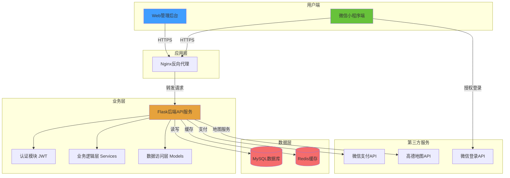

## 2. 前后端分离架构

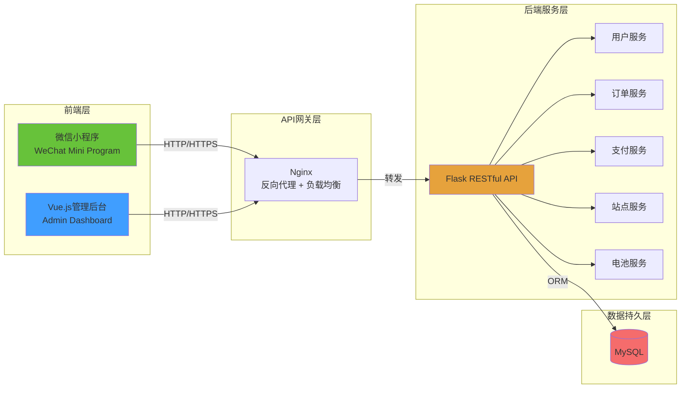

## 3. 技术栈架构

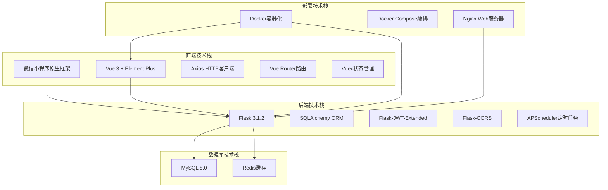

## 4. 业务流程架构

### 4.1 用户租用电池流程

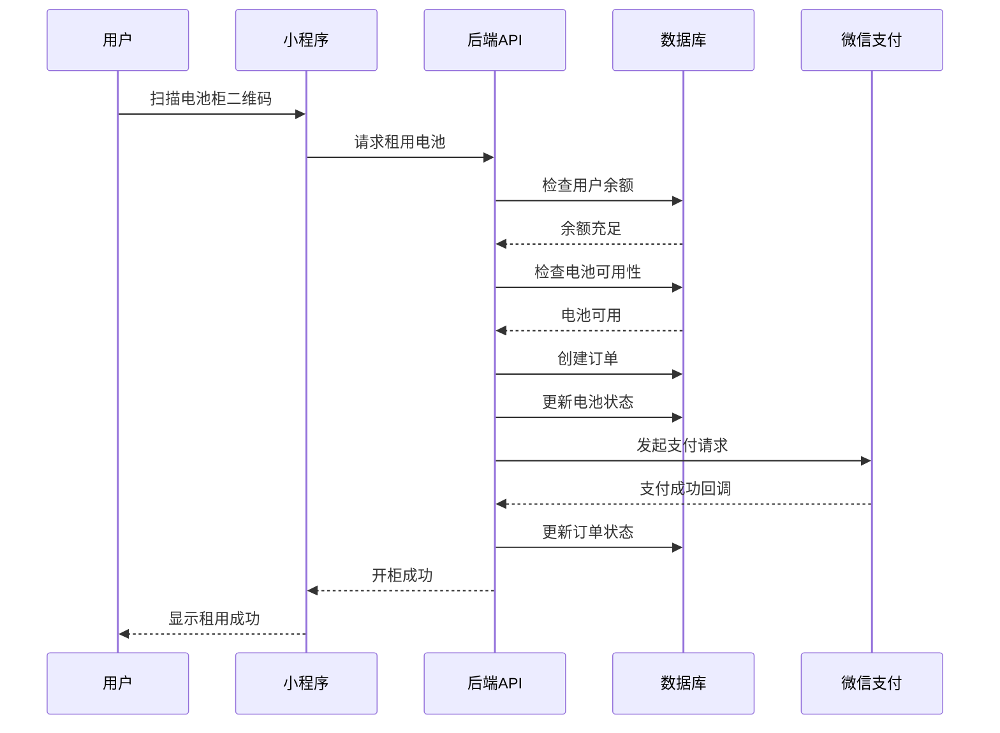

### 4.2 管理员管理流程

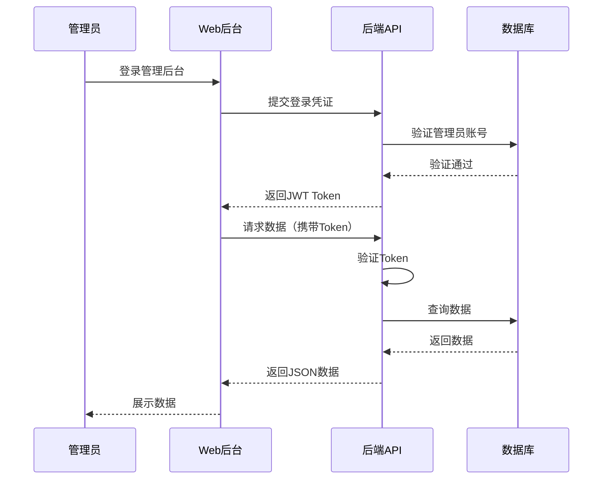

## 5. 多租户架构

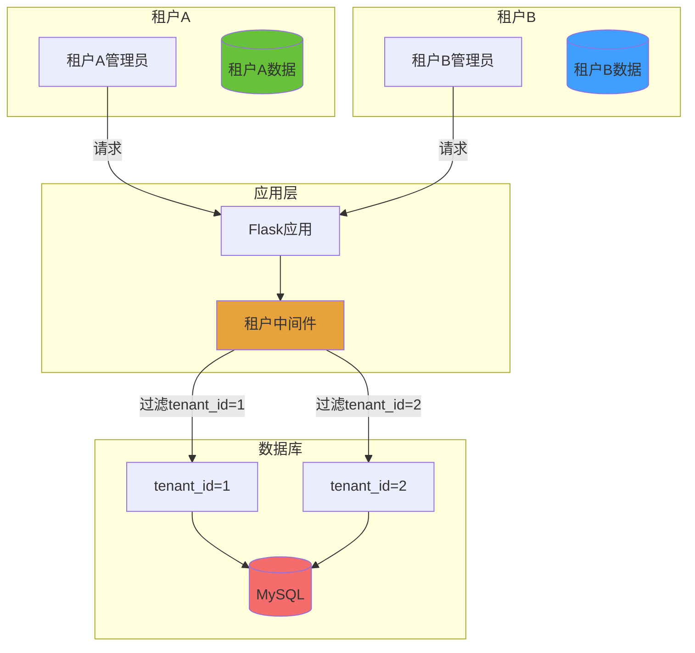

## 6. 部署架构（Docker）

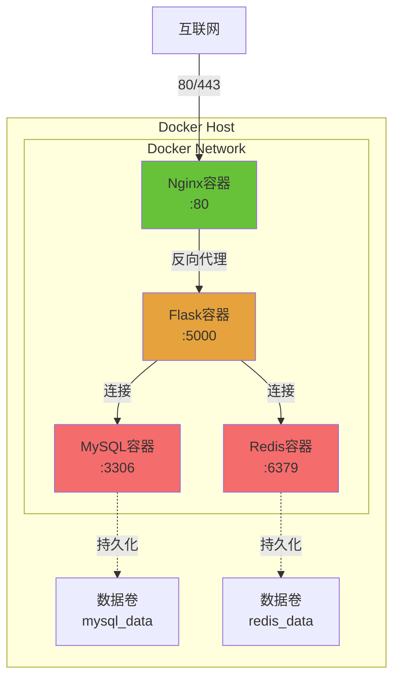

## 7. 安全架构

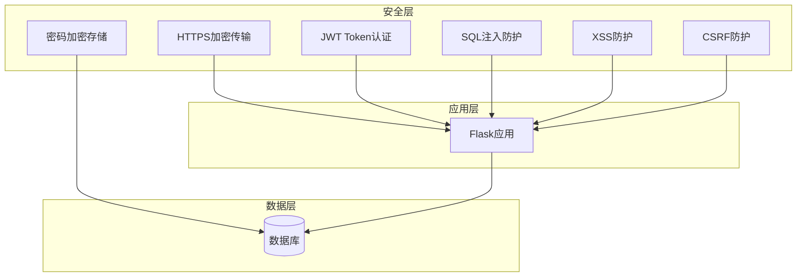

## 8. 核心模块说明

### 8.1 后端核心模块

| 模块 | 说明 | 技术 |
|------|------|------|
| 认证模块 | 用户登录、JWT生成验证 | Flask-JWT-Extended |
| 用户模块 | 用户管理、余额管理 | SQLAlchemy |
| 订单模块 | 订单创建、状态管理 | SQLAlchemy + APScheduler |
| 支付模块 | 微信支付集成 | 微信支付API |
| 站点模块 | 站点管理、地图服务 | 高德地图API |
| 电池模块 | 电池状态管理 | SQLAlchemy |
| 租户模块 | 多租户数据隔离 | 中间件 + tenant_id |

### 8.2 前端核心模块

| 模块 | 说明 | 技术 |
|------|------|------|
| 路由管理 | 页面路由、权限控制 | Vue Router |
| 状态管理 | 全局状态管理 | Vuex |
| API封装 | HTTP请求封装 | Axios |
| 地图组件 | 地图展示、定位 | 高德地图API |
| 支付组件 | 微信支付调用 | 微信支付API |

## 9. 数据流向图

```mermaid
graph LR
    A[用户操作] --> B[前端验证]
    B --> C[发送HTTP请求]
    C --> D[Nginx转发]
    D --> E[Flask路由]
    E --> F[JWT验证]
    F --> G[业务逻辑处理]
    G --> H[数据库操作]
    H --> I[返回结果]
    I --> J[JSON响应]
    J --> K[前端渲染]
    K --> L[用户界面更新]
    
    style A fill:#67C23A
    style F fill:#E6A23C
    style H fill:#F56C6C
    style L fill:#409EFF
```

## 10. 扩展性设计

### 10.1 水平扩展

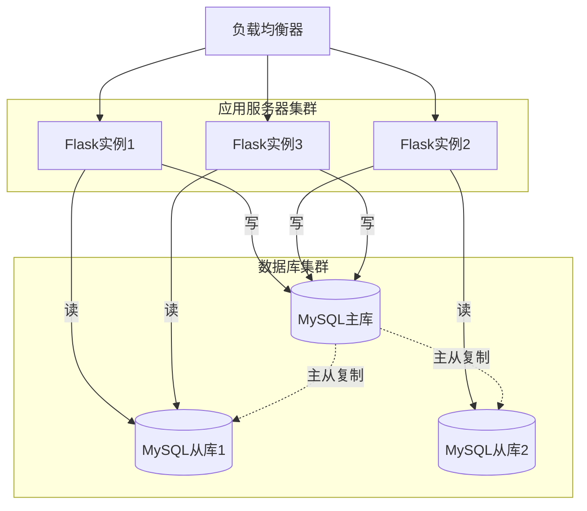

### 10.2 微服务拆分方向

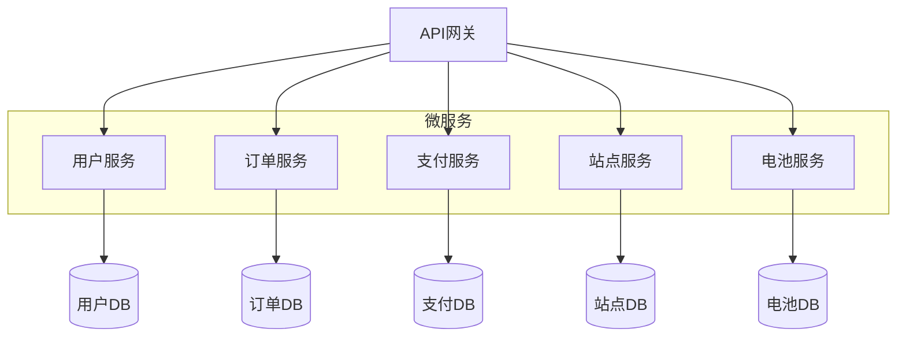

---

**说明**：
- 本架构图使用 Mermaid 语法绘制，可在支持 Mermaid 的 Markdown 编辑器中查看
- 推荐使用 Typora、VS Code (Markdown Preview Mermaid Support插件) 或在线工具查看
- 答辩时可以将这些图导出为图片插入到 PPT 中
